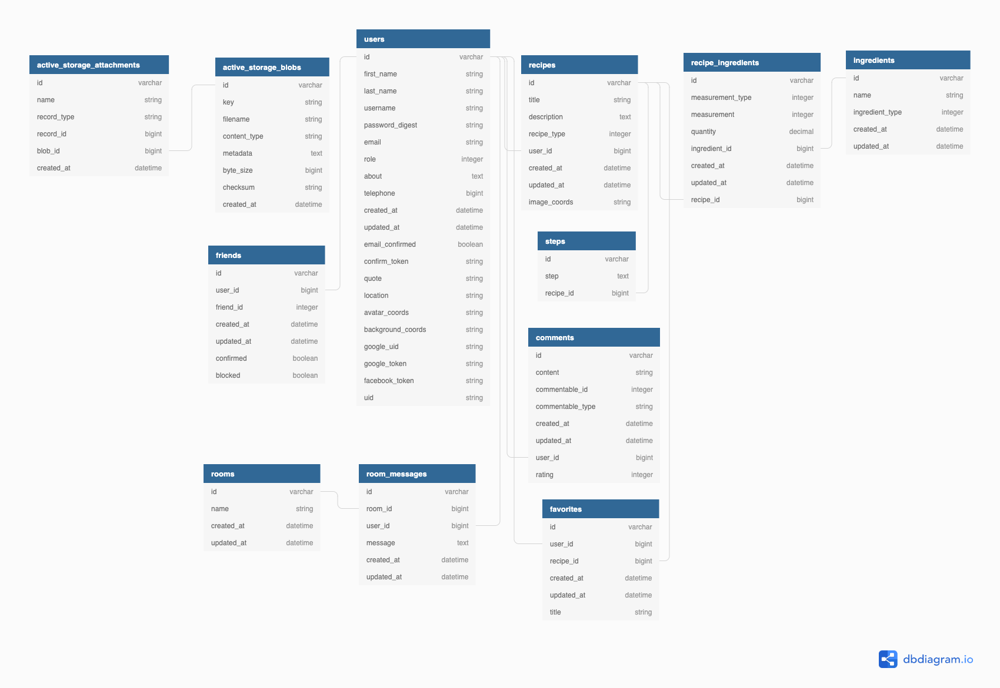

# Recipe Friend

This project is a social media app for food and recipes. Add friends, join chat rooms and talk about food. Talk to Alexa to open the recipe friend app in chrome and search for recipes. Users can find, add, share and convert recipes. Great for restaurants who need different batch sizes! Users can input in the number of portions they want and the recipe will automatically convert the quantity for ingredients. Recipes can be read by Alexa for a hands free experience. This app also makes it easy to create a grocery list according to ingredients in a recipe. Recipe's are of course rated and commented on by any registered user. A user can create or join groups and once in a room can chat with each other in a chatroom. 

This application uses the microservice alexa_recipe to allow recipes to be accessed through Alexa. Alexa_recipe is located at https://github.com/ryanmillergm/recipe_alexa. Alexa can access the recipe_friend database and open recipes in chrome.

This REST API has several endpoints for basic CRUD functionality of **users**, **recipes**, **comments**, **grocery_list**, **friends** and **groups**. All responses are JSON.

The app is deployed at http://recipehound.km6rdxpp4h.us-west-2.elasticbeanstalk.com/.

View the project board at https://github.com/ryanmillergm/recipe_friend/projects/1

## Schema


## Tech Stack
 - Framework: Ruby on Rails v5.2.3
 - Language: Ruby
 - Database: PostgreSQL v7.12.1
 - Query Language: ActiveRecord
 - Testing: RSpec

## Other Packages
 - Figaro
 - Faraday
 - Active Model Serializers v0.10.0
 - Redis
 - Ngrok

## Local Setup
 - `$ git clone https://github.com/ryanmillergm/recipe_friend.git`
 - `$ cd recipe_friend`
 - `$ bundle exec install`
 - `$ bundle exec rails db:create`
 - `$ bundle exec rails db:migrate`
 - `$ bundle exec rails db:seed`
 - `$ bundle exec figaro install`

## Additional steps
 - To run chat locally, install Redis. If you’re running Ubuntu, you can use `apt install redis-server`, on Mac you can use `brew install redis`
 - Open a terminal and run Redis in addition to running your localhost:3000 `rails server`. Once the server is up & running you’ll be able to use `redis-cli` to connect to the server.
 -  You may have to run `redis-server` on another terminal to start the server before you can connect to it.

## Running the Server Locally
 - `$ rails s`
 - Access local endpoints at `http://localhost:3000`
 - Access deployed endpoints at `https://somewhere.com`

## Running the Test Suite
 - `$ rspec`

## API Endpoints - (Specifically designed for Alexa Skill)
 ### Get all recipes
Request:
```
GET /api/v1/recipes
Accept: application/json
```
Example response:
```
Status: 200
Content-Type: application/json
Body:
{
 :data=>
  [
   {
    :id=>"1", 
    :type=>"recipe", 
    :attributes=>{
     :title=>"Spaghetti", 
     :description=>"This recipe is for Spaghetti"
     }
    },
   {
    :id=>"2", 
    :type=>"recipe", 
    :attributes=>{
     :title=>"Chicken Noodle Soup", 
     :description=>"This recipe is for chicken noodle soup"
     }
    },
   {
    :id=>"3", 
    :type=>"recipe", 
    :attributes=>{
     :title=>"Fresh Lasagna pasta", 
     :description=>"This recipe is for lasagna noodles"
     }
    },
   {
    :id=>"4", 
    :type=>"recipe", 
    :attributes=>{:title=>"Pot Roast", 
    :description=>"This recipe is for a delicious slow cooked beef potroast"
    }
   }
  ]
}
```

### Get a specific recipe by name
Request:
```
GET /api/v1/recipes/spaghetti
Accept: application/json
```
Example response:
```
Status: 200
Content-Type: application/json
Body:
{
 :data=>
  [
   {
    :id=>"1", 
    :type=>"recipe", 
    :attributes=>{
     :title=>"Spaghetti", 
     :description=>"This recipe is for Spaghetti"
     }
   }
  ]
}
```

### Get a specific recipe by mutiple word description (String)
 - Pass in food params to api. Ex/ food = "fresh lasagna pasta"
 
Request:
```
GET /api/v1/recipes/#{food.gsub(/[ ]/, '%20')}
Accept: application/json
```
Example response:
```
Status: 200
Content-Type: application/json
Body:
{
 :data=>
  [
   {
    :id=>"2", 
    :type=>"recipe", 
    :attributes=>{
     :title=>"Chicken Noodle Soup", 
     :description=>"This recipe is for chicken noodle soup"
     }
   }
  ]
}
```

## Core Contributors
 - Ryan Miller, [@ryanmillergm](https://github.com/ryanmillergm)

### How to Contribute
 - Fork and clone the [repo](https://github.com/ryanmillergm/recipe_friend.git)
 - Make changes on your fork & push them to GitHub
 - Visit https://github.com/ryanmillergm/recipe_friend and click `New pull request`
 
## Current Iterations
 - Convert recipes according to portions

## Future Iterations
 - Create a grocery list of ingredients from a recipe

## Known Issues
 - None
